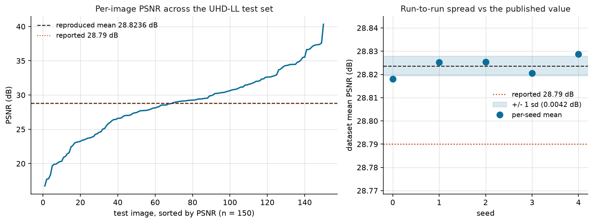
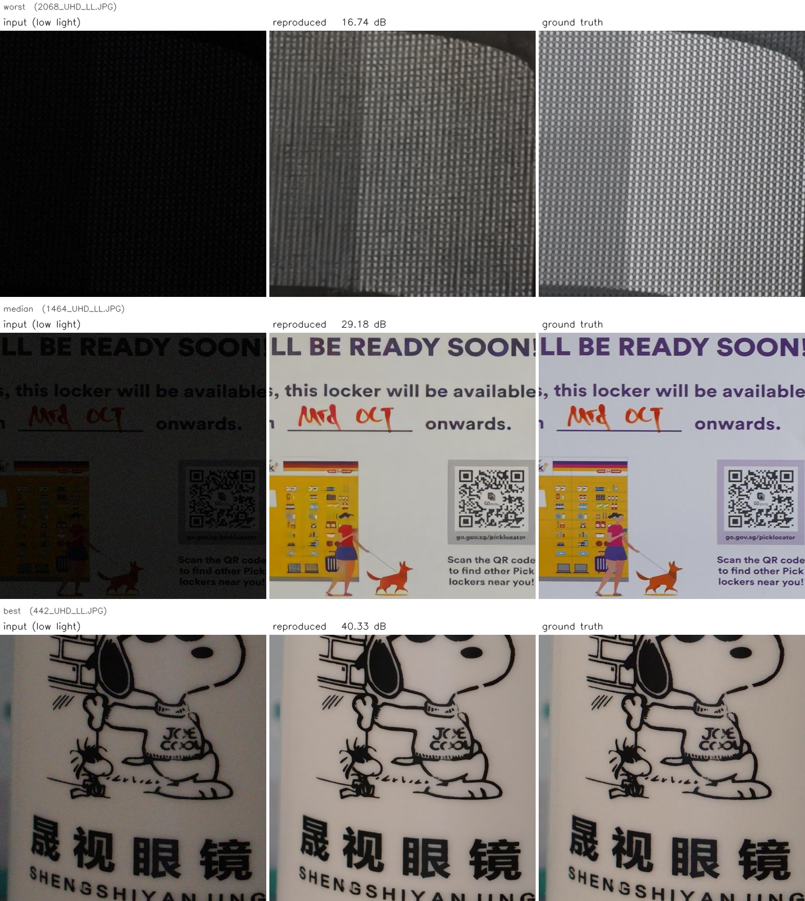

# Reproducing RetinexDual

[](https://github.com/lemoon01110/Reproducing-RetinexDual/actions/workflows/checks.yml)

An independent reproduction of **RetinexDual** (Kishawy, Hussein and Chen, ICPR 2026,
[arXiv:2508.04797](https://arxiv.org/abs/2508.04797)) on the UHD-LL low-light benchmark.

The badge covers internal consistency only, not the measurements. See section 7.

The paper's headline PSNR reproduces. Its SSIM does not, and after testing six SSIM conventions
against it I still cannot account for the difference. Getting to either number took working around
three undocumented defects in the released repository, each of which stops a clean checkout from
running at all, plus two further traps that do not stop it running and instead hand you a number
that is quietly wrong.

| | Reported | Reproduced | |
|---|---|---|---|
| **PSNR** | 28.79 dB | **28.8199 +/- 0.0027 dB** | reproduces, +0.030 dB |
| **SSIM** | 0.934 | 0.92217 +/- 0.00002 | **does not reproduce, -0.012** |

Both halves are here, the confirmation and the failure, with the raw per-image data behind them.
Section 1 covers what I tested on the SSIM gap, what it ruled out, and what remains open.

Upstream: [ErrorLogic1211/RetinexDual](https://github.com/ErrorLogic1211/RetinexDual) at commit
`9feec2c0814d740221db2323e5e815a4d455abb6`.

---

## 1. What reproduces, and what does not

UHD-LL testing set, all 150 pairs at 3840x2160, released `UHD_LL.pth` weights, released inference
path, RTX 4090.

Default inference is stochastic (see section 4.2), so a single run is not a reproducible quantity.
Every number below is the mean over 5 independent seeds, each a full 150-image evaluation.

| Metric | Reported | Reproduced | Difference |
|---|---|---|---|
| PSNR (dB) | 28.79 | **28.8199 +/- 0.0027** | **+0.030** |
| SSIM | 0.934 | 0.92217 +/- 0.00002 | -0.0118 |



Spread across seeds was 28.8173 to 28.8235. Per-image scores range from 16.74 dB to 40.33 dB, with
a mean run-to-run standard deviation of 0.029 dB per image.

The right panel is the useful one. All five seeds sit inside a 0.006 dB band, about a fifth of the
0.030 dB gap to the published value, so the reproduction is far tighter than the quantity it is
being compared against. The left panel is a reminder that a dataset mean hides a lot: individual
images span more than 23 dB.

PSNR lands 0.030 dB above the published value, which is well inside what counts as a match.

**SSIM does not reproduce.** It comes out 0.0118 low, which is roughly 700 times the 0.000016
run-to-run spread, so this is a real difference and not noise.

The hypothesis worth testing was that this is a difference in how SSIM is defined rather than in
what the model produced, because **PSNR matches to 0.030 dB on the exact same output images**. A
model genuinely producing worse restorations would be expected to miss on both. "SSIM" also names a
family rather than one number: the repository's helper averages per-channel SSIM over RGB with a
MATLAB-style 11x11 Gaussian, while other common choices score luma only, crop a border, or use
scikit-image's 7x7 uniform default. Measured here, those choices differ from each other by 0.024,
which is twice the gap being explained, so the hypothesis was worth taking seriously.

[`scripts/ssim_protocol_probe.py`](scripts/ssim_protocol_probe.py) tests exactly this, scoring one
set of model outputs under six conventions. A 40-image pilot showed the three scikit-image variants
agreeing with their MATLAB-kernel equivalents to five decimals, so the full 150-image run carries
the three that differ:

| protocol | SSIM | vs repo helper | vs paper |
|---|---|---|---|
| `matlab_y` (luma, 11x11 Gaussian) | 0.94656 | +0.02438 | **+0.01256** |
| `matlab_y_border4` (luma, 4px border crop) | 0.94652 | +0.02434 | +0.01252 |
| `repo_rgb_mean` (what this repo reports) | 0.92218 | 0.00000 | **-0.01182** |

All 150 images, one seed. SSIM's run-to-run spread is 0.000016, so a single seed is sufficient here
in a way it is not for PSNR.

**The hypothesis fails, and the gap stays open.** No convention tested lands on 0.934. The published
value falls *between* per-channel RGB and luma, roughly 0.012 from each, so it is not simply that
the authors used the other common convention.

Two things this does establish. The probe agrees with the main evaluation to five decimals
(0.92218 against 0.92217), so the reproduction's SSIM is not an artifact of how it is computed. And
scikit-image configured with the same kernel reproduces both the RGB and luma figures exactly, so
the MATLAB-style implementation here is not itself the problem.

For completeness, since it is the first thing a reader will notice: the midpoint of the two
conventions is 0.93437, which is close to 0.934. I have no mechanism that would make an average of
two metrics meaningful, so I am recording it as a coincidence rather than a finding.

Candidates I did not test, and cannot from here, include a different evaluation split, a different
checkpoint from the one released, or an SSIM implementation not among those above. **This is the one
question I would put to the authors.** I am not claiming the paper is wrong.

Raw data: [`results/reproduction_seeds.csv`](results/reproduction_seeds.csv) (5 rows, one per seed)
and [`results/reproduction_per_image.csv`](results/reproduction_per_image.csv) (150 rows).

### What the outputs actually look like

A reproduction that reports only scalars is hard to check. Below are the worst, median and best
scoring images in the test set, chosen **by rank from the per-image CSV rather than by eye**, with
the detail crop inside each picked by gradient energy on the ground truth so the panels show texture
instead of flat wall. Regenerate with
[`scripts/make_qualitative.py`](scripts/make_qualitative.py).



The worst case at 16.74 dB is the useful one to look at. It is a fine metallic mesh, and the output
is a plausible restoration that loses the exact phase of the weave rather than a broken image. That
is the failure mode you would expect from a hard high-frequency texture, and it is evidence the
16.74 dB is the benchmark being hard rather than the reproduction being wrong. At the median the
text and QR code are legible and close to ground truth.

### Metric protocol

Stated explicitly, because PSNR is only comparable when the protocol is:

- RGB channels, not luma. Range [0, 255]. `20 * log10(255 / sqrt(mse))`.
- No border crop.
- Computed per image, then averaged over the 150 images.
- Input is reflect-padded from 3840x2160 to 3840x2176 by `check_image_size`, matching the released
  `inference_RetinexDual.py`. Output is cropped back to 2160 before scoring.

---

## 2. Three defects that stop the released code from running

All three are in the released repository as of commit `9feec2c`. They are independent, and you hit
them in this order.

### 2.1 `requirements.txt` cannot be installed as written

The file pins these three lines together:

```
torch==2.7.1
mamba_ssm==2.2.4
causal_conv1d==1.5.0.post8
```

`mamba_ssm` and `causal_conv1d` ship prebuilt CUDA wheels tagged against a specific torch version.
Checked against the GitHub release API, **neither package publishes a wheel for torch 2.7**. Both
top out at torch 2.6, having been built in December 2024, before PyTorch 2.7 existed.

So the pinned set has no solution. Any environment built by following the README either silently
lacks the Mamba kernels or fails outright.

**The right lesson is narrower than "ignore their pins," and I learned it the hard way.** Building
this repository's `setup_env.sh` I dropped the pin on `transformers` while fixing the torch
conflict. That breaks the build, though not until the very last step:

```
ImportError: cannot import name 'GreedySearchDecoderOnlyOutput'
             from 'transformers.generation'
```

`mamba_ssm`'s top-level `__init__` imports `MambaLMHeadModel`, which reaches into
`transformers.generation` for a name that **transformers 5.x removed**. Unpinned, pip resolves to
5.x and every `import mamba_ssm` fails. Upstream pins `transformers==4.52.4`, which works.

So exactly one line of that `requirements.txt` is impossible and the rest are load-bearing. The fix
is to move torch and change nothing else, not to treat the file as untrustworthy. This one cost a
full environment rebuild to find, because nothing fails until the kernels are first imported.

### 2.2 The obvious fix fails on any glibc older than 2.32

The natural response is to keep torch 2.7.1 and bump the kernels to their first torch 2.7 builds,
`mamba_ssm==2.3.0` and `causal_conv1d==1.6.0`. On Ubuntu 20.04 that produces:

```
ImportError: /lib/x86_64-linux-gnu/libc.so.6: version `GLIBC_2.32' not found
    (required by .../selective_scan_cuda.cpython-311-x86_64-linux-gnu.so)
```

Those wheels are built on newer CI runners. Maximum required glibc symbol, measured per wheel:

| Wheel | Requires | Loads on glibc 2.31 |
|---|---|---|
| `mamba_ssm` 2.3.0 / torch2.7 | GLIBC_2.32 | no |
| `causal_conv1d` 1.6.0 / torch2.7 | GLIBC_2.32 | no |
| `mamba_ssm` 2.2.4 / torch2.6 | GLIBC_2.14 | yes |
| `causal_conv1d` 1.5.0.post8 / torch2.6 | GLIBC_2.14 | yes |

Ubuntu 20.04 ships glibc 2.31. It is still a very common deployment target and it is what this
machine runs.

**Resolution used here: pin torch to 2.6.0 and keep the repository's exact pinned kernel versions.**
This moves only torch and leaves `mamba_ssm` and `causal_conv1d` at exactly the versions the authors
pinned, which is the smaller deviation of the two available.

The check that backs this is empirical rather than an argument about version numbers. After
install, `selective_scan_fn` (CUDA) agrees with `selective_scan_ref` (the pure PyTorch reference) to
a maximum absolute difference of **3.8e-6**, and the end-to-end reproduction in section 1 lands
within 0.030 dB of the published PSNR. `setup_env.sh` runs that kernel comparison as an assertion,
so a mismatched wheel fails at setup rather than silently producing wrong numbers.

### 2.3 The documented install command fails

The README instructs:

```bash
python setup.py develop --no_cuda_ext
```

This fails. `setup.py` calls `import torch` at line 9, and pip's PEP-517 build isolation hides torch
from the build environment. The `--no_cuda_ext` flag cannot survive a PEP-517 build either.

Since `--no_cuda_ext` means there are no extensions to build in the first place, the install reduces
to making `basicsr` importable. A `.pth` file in site-packages does that. `basicsr` has no
`__init__.py` and resolves as a namespace package, so this works.

---

## 3. Two traps that do not stop the code running

These are worse in one respect than the three above. A build failure is loud. These two run to
completion and hand you a number that is wrong.

### 3.1 The documented CPU fallback cannot run at UHD

The upstream README suggests that on machines where the CUDA kernels will not build you can drop in
a pure-PyTorch `selective_scan_ref` and alias `selective_scan_fn` to it, describing it as
"numerically equivalent, just slower."

Numerically equivalent it is. Viable at ultra-high definition it is not. At this model's largest
sequence length the reference path allocates two `(B, d_inner, L, d_state)` tensors, `deltaA` and
`deltaB_u`. With `B=1, d_inner=72, L=2,088,960, d_state=16` in fp32 that is **9.6 GB each, about
19 GB before anything else**, and it then runs a Python-level `for` loop over all 2,088,960
timesteps, appending to a list that is stacked at the end.

"Slower" undersells this by orders of magnitude. The correct reading is that the fallback is a
correctness reference only, and **any latency measured against it is not a measurement of
RetinexDual**. For scale, the real CUDA kernel runs that same scan in 29.2 ms.

A related hazard, and the reason `scripts/evaluate.py` checks for it: Python puts the working
directory ahead of site-packages, so a local directory named `mamba_ssm` silently shadows the
installed package. If that directory contains the reference fallback, everything imports, everything
runs, and every number afterwards is meaningless.

### 3.2 The metric average divides by the wrong count

In `inference_RetinexDual.py`, `num_img` increments in **both** branches of the ground-truth check
(lines 136 and 143), while `psnr_all`, `ssim_all` and `lpips_all` accumulate only in the branch
where ground truth was found:

```python
if gt_img is not None:
    ssim_all += ssim
    psnr_all += psnr
    lpips_all += lpips_value
    num_img += 1
else:
    num_img += 1          # <- counted, but nothing was added to the sums
...
print('avg_psnr:%f' % (psnr_all / num_img))
```

So any input image without a matching ground truth file is counted in the divisor but contributes
zero to the numerator, which drags the reported average down.

**Scope, stated carefully.** On the official UHD-LL testing set all 150 images are paired, so this
does not fire and it has no bearing on the paper's reported number. It bites when you point the
script at a partial download, a subset or a folder with mismatched filenames, which is exactly what
a reproducer does first. The same guard also means a silently truncated Google Drive download
produces a plausible-looking but deflated PSNR rather than an error. `scripts/evaluate.py` counts
only paired images and prints a warning when it finds unpaired ones.

---

## 4. Two properties of the released artifacts

Neither of these is a reproduction failure. Both are things a reproducer should know.

### 4.1 The released checkpoint predates the released code

Loading `UHD_LL.pth` reports **60 missing keys and 0 unexpected keys**. The released
`inference_RetinexDual.py` uses `strict=False`, so this passes in silence.

| | Tensors | Parameters |
|---|---|---|
| Model built by the released code | 826 | 4,747,035 |
| Released checkpoint | 766 | 4,725,531 |

The checkpoint's 4,725,531 parameters match the paper's stated 4.726M. The code builds 4.747M. All
60 extra tensors belong to 12 `SpectralGuidanceModule` instances in the illumination branch. The
conclusion is simply that **the released code is a later revision than the released checkpoint**.

This is harmless, and I verified that rather than assuming it. Every `SpectralGuidanceModule` ends
with `out = freq_features + self.alpha * (conditioned - freq_features)` where `alpha` is
zero-initialised. All 12 alphas load as exactly 0.0, and replacing every such module with an
identity gives bit-identical output, maximum absolute delta 0.0. The randomly initialised tensors
cannot reach the output.

**This says nothing about whether the paper's numbers are right.** It shows only that two released
artifacts come from different revisions.

### 4.2 Default inference is not deterministic

`RetinexDuelSambaFusionFinalization_arch.py:744` calls:

```python
cls_policy = F.gumbel_softmax(pred_route, hard=True, dim=-1)
```

There is no `if self.training` guard anywhere on this path, so `model.eval()` and
`torch.inference_mode()` do not suppress the sampling. `inference_RetinexDual.py:14` sets
`torch.manual_seed(123)` once at import, which is not sufficient, because warmup passes and repeated
iterations consume RNG state and successive forwards then route differently.

Five real test images, five forward passes each, runs 2 to 5 compared against run 1:

| Mode | RNG reset per forward | Identical | Max pixel delta | Pairwise PSNR |
|---|---|---|---|---|
| Natural inference, as released | no | **no** | 0.007 to 0.049 | 59.09 to 64.19 dB |
| Exact RNG replay | yes | yes, bit-identical | 0.000 | inf |
| Deterministic argmax routing | n/a | yes, bit-identical | 0.000 | inf |

The verdict holds on every image tested, which matters because two earlier versions of this table
rested on a single input and both overstated the spread. See
[`DETERMINISM.md`](DETERMINISM.md).

The RNG replay row is the decisive one. Restoring CPU and CUDA RNG state before each forward makes
output bit-identical, which isolates the variation entirely to sampling in the routing path and
rules out kernel-level nondeterminism. Had any existed, that row would still have differed.

The practical consequence, and the reason section 1 reports 5 seeds rather than one run: **the
released evaluation path produces run-dependent output and therefore run-dependent PSNR.** Any
comparison against it needs repeated evaluation and a stated variance.

To be clear about scope, this is a fact about the released implementation run on my hardware. It is
not evidence about how the paper's table was produced. The authors may have used a fixed seed, a
per-image RNG reset, a different commit or a separate evaluation wrapper.

---

## 5. Environment

Full detail, including checksums and the reasoning behind each version choice, is in
[`ENVIRONMENT.md`](ENVIRONMENT.md).

| Item | Value |
|---|---|
| GPU | RTX 4090, 24 GB, compute capability 8.9 |
| OS | Ubuntu 20.04.6 LTS, glibc 2.31 |
| Python | 3.11 |
| torch | 2.6.0+cu124 (deviation, see 2.2) |
| mamba_ssm | 2.2.4 (exactly as pinned) |
| causal_conv1d | 1.5.0.post8 (exactly as pinned) |
| Weights | `UHD_LL.pth`, sha256 `1977bb77...cae182`, 19,272,064 bytes |
| Dataset | UHD-LL testing set, 150 pairs, 0 corrupt, 150/150 paired |

Measured by [`scripts/measure_footprint.py`](scripts/measure_footprint.py), 5 groups of 5 iterations
after 5 warmup passes, fp32:

| Input | Padded | Mpix | CUDA-event median | Working set | GiB per Mpix | Reserved |
|---|---|---|---|---|---|---|
| 1280x768 | 1280x768 | 0.98 | 102.21 ms | 1.31 GiB | 1.337 | 9.37 GiB |
| 1920x1088 | 1920x1152 | 2.21 | 287.31 ms | 2.92 GiB | 1.320 | 17.68 GiB |
| 2560x1408 | 2560x1408 | 3.60 | 548.25 ms | 4.73 GiB | 1.313 | 18.20 GiB |
| **3840x2160** | **3840x2176** | 8.36 | **1347.73 ms** | **10.94 GiB** | 1.309 | **19.54 GiB** |

Latency and working set come from separate invocations (`--mode latency` and `--mode memory`)
because they need opposite settings of `cudnn.benchmark` and contaminate each other in one
process. Both are backed by [`results/footprint_latency.json`](results/footprint_latency.json) and
[`results/footprint_memory.json`](results/footprint_memory.json), which `scripts/check_report.py`
verifies this table against. Running both together cost about 1.5% on the 4K timing, which is larger than the
group-to-group spread, so the script now warns when you do that.

Peak allocation is linear in pixel count at **1.31 GiB per Mpix**, holding to within 2% across an
8.5x range. That constant was also measured independently on a different GPU (an 8 GB RTX 5070
Laptop, compute capability 12.0) at 1.31 GiB per Mpix, so it is a property of the model rather than
of one card.

**A card with less than about 20 GiB will not hold whole-image 4K inference here.** The working set
is 10.94 GiB, but with `cudnn.benchmark = True` the allocator reserves 19.54 GiB, and reserved is
what determines whether the run fits.

Wall clock and CUDA-event timings agree to within 0.02% at every resolution, and group-to-group
spread at 4K is under 1 ms out of 1348 ms. An earlier, separately written harness measured the
same 4K forward at 1347.89 ms, within 0.02% of the figure above. Harness sanity check first, on the principle that something
which cannot recover a known cost should not be trusted on an unknown one: an 8192-cubed fp16 matmul
reaches 161.4 TFLOPS, in line with this card's specification.

One caveat found while measuring, and the reason working set and reserved are reported separately.
With `cudnn.benchmark = True`, peak *allocated* came out non-monotonic in resolution (15.64 GiB at
1920x1152 against 15.28 GiB at 3840x2176), which cannot be a real working set. cuDNN's algorithm
search allocates trial workspaces that land in the peak statistic, and it declines the larger ones
once they stop fitting. Measured with benchmark off, the same sweep is linear to within 2%.

---

## 6. Reproducing this

Nothing from upstream is vendored here, so you fetch three things yourself: the code, the weights
and the dataset.

```bash
# 1. This repository
git clone https://github.com/lemoon01110/Reproducing-RetinexDual
cd Reproducing-RetinexDual

# 2. The upstream code, pinned to the commit this report was written against
git clone https://github.com/ErrorLogic1211/RetinexDual ~/RetinexDual
git -C ~/RetinexDual checkout 9feec2c0814d740221db2323e5e815a4d455abb6

# 3. The weights
mkdir -p ~/RetinexDual/pretrained_weights
curl -L -o ~/RetinexDual/pretrained_weights/UHD_LL.pth \
  https://huggingface.co/ErrorLogic/RetinexDual/resolve/main/UHD_LL.pth

# 4. Build the environment (section 2 explains why it does not follow requirements.txt)
REPO_DIR=~/RetinexDual bash setup_env.sh
conda activate retinexdual-repro

# 5. Run it
REPO_DIR=~/RetinexDual DATA_DIR=~/data/UHD_LL/testing_set bash reproduce.sh
```

`setup_env.sh` refuses to finish if the CUDA kernels disagree with the reference implementation, so
a mismatched wheel fails there rather than silently producing wrong numbers. `reproduce.sh`
checksums the weight file, verifies the dataset, then writes `results/reproduction_seeds.csv`,
`results/reproduction_per_image.csv` and `results/reproduction_summary.json`, and prints the
comparison table from section 1.

**You have to supply the UHD-LL testing set yourself.** It is distributed through
[Google Drive](https://drive.google.com/drive/folders/1IneTwBsSiSSVXGoXQ9_hE1cO2d4Fd4DN), which
rate-limits folder downloads of this size, so an automated fetch is not reliable. Download
`testing_set/input` and `testing_set/gt`. Run `python scripts/check_data.py --data <path>` first.
It prints the expected layout and verifies pairing, dimensions and decodability, which matters
because a truncated Drive download is the normal failure mode and section 3.2 explains how that
turns into a plausible but wrong PSNR rather than an error.

Budget roughly 20 minutes per seed on a 4090. SSIM at 3840x2160 is computed on the CPU and
dominates the wall clock, not the forward pass. Two flags exist for checking the plumbing before
committing to the full run, and both label themselves in the output so their results cannot be
mistaken for a reproduction:

```bash
bash reproduce.sh -- --limit 4 --skip-ssim    # a couple of minutes, verifies everything wires up
```

Anything after `--` is passed through to `scripts/evaluate.py`.

The two supporting tables regenerate independently:

```bash
python scripts/determinism_audit.py --repo ~/RetinexDual --image <one input image>   # section 4.2
python scripts/measure_footprint.py --repo ~/RetinexDual --sweep                     # section 5
python scripts/make_figure.py                                                        # the figure
```

---

## 7. Scope, and what this is not

- This is a reproduction of one task, low-light enhancement on UHD-LL. The paper covers four. I did
  not attempt deraining, deblurring or dehazing.
- Everything here is inference. No training was run and no claim about trainability is made.
- The three defects are packaging and documentation problems in a released repository. They are
  ordinary, they are the normal condition of research code, and they say nothing about the quality
  of the method. The method reproduces.
- Where a number came out against my expectation, in particular the SSIM gap, it is reported as
  unresolved instead of explained away. The metric-convention hypothesis was tested and failed.
- Several figures in earlier revisions of this report were wrong and were corrected against fresh
  measurements rather than quietly dropped. The determinism table was measured on synthetic noise
  and overstated the effect. The memory sweep was contaminated by cuDNN's algorithm search. The
  first SSIM probe compared a 40-image subset against a full-set published number. Each is now
  noted at the point where it appears. The git history has the details.
- The single largest thing this cannot settle: whether the paper's SSIM protocol matches any of the
  ones tested here. Only the authors can answer that.
- **CI here does not verify the results.** The substantive claims need a 4K-capable GPU and a
  licence-restricted dataset, neither available to a GitHub runner. What CI does check is that the
  scripts compile and expose their flags, that internal links resolve, that the figures quoted in
  the prose match the committed CSVs and JSON artifacts, and that the writing conventions hold. A
  green badge means the report is internally consistent, not that the numbers were re-measured.

### What has actually been executed

Stated because "the scripts are in the repository" and "the scripts run" are different claims, and
the whole point of section 2 is that upstream shipped instructions nobody had executed.

| | Status |
|---|---|
| `setup_env.sh`, clean environment from scratch | run, exit 0, kernels verified at 3.81e-06 |
| `setup_env.sh` failure branches | all four exercised, see below |
| `reproduce.sh` end to end | run from a clean checkout against the env `setup_env.sh` built |
| `scripts/evaluate.py` full reproduction | 5 seeds x 150 images |
| `scripts/determinism_audit.py` | 5 images, artifact committed |
| `scripts/measure_footprint.py` | both modes, sweep, artifacts committed |
| `scripts/ssim_protocol_probe.py` | 150 images |
| `scripts/check_report.py` | negative-tested on deliberately broken copies |

The four failure branches of `setup_env.sh` were each triggered deliberately: conda absent (clean
message, exit 1), ABI tag mismatch (clean message, exit 1), `REPO_DIR` missing (warns and continues,
which is the intended behaviour), and the kernel-versus-reference assertion (fires when the
tolerance is made impossible, which confirms the check is not vacuous).

## 8. Files

| Path | Contents |
|---|---|
| [`ENVIRONMENT.md`](ENVIRONMENT.md) | versions, checksums, provenance, every deviation and why |
| [`DETERMINISM.md`](DETERMINISM.md) | the nondeterminism audit in full |
| [`setup_env.sh`](setup_env.sh) | builds the working environment, and verifies the kernels load |
| [`reproduce.sh`](reproduce.sh) | checksums the weights, checks the data, runs the evaluation |
| [`scripts/evaluate.py`](scripts/evaluate.py) | the evaluation itself, 5 seeds over 150 images |
| [`scripts/check_data.py`](scripts/check_data.py) | dataset pairing, dimensions and decodability |
| [`scripts/determinism_audit.py`](scripts/determinism_audit.py) | regenerates the table in section 4.2 |
| [`scripts/measure_footprint.py`](scripts/measure_footprint.py) | regenerates the memory and latency table in section 5 |
| [`scripts/make_figure.py`](scripts/make_figure.py) | renders the PSNR figure from the committed CSVs |
| [`scripts/make_qualitative.py`](scripts/make_qualitative.py) | renders the worst/median/best image strip |
| [`scripts/check_report.py`](scripts/check_report.py) | guards links, prose-vs-CSV numbers, and writing conventions |
| [`scripts/ssim_protocol_probe.py`](scripts/ssim_protocol_probe.py) | scores outputs under six SSIM conventions |
| `results/reproduction_seeds.csv` | 5 rows, dataset-level PSNR and SSIM per seed |
| `results/reproduction_per_image.csv` | 150 rows, per-image mean and standard deviation |
| [`results/README.md`](results/README.md) | provenance and column meanings for both CSVs |

## Citation

The work being reproduced:

```bibtex
@inproceedings{kishawy2026retinexdual,
  title={RetinexDual: Retinex-based Dual Nature Approach for Generalized
         Ultra-High-Definition Image Restoration},
  author={Kishawy, Mohab and Hussein, Ali Abdellatif and Chen, Jun},
  booktitle={Proceedings of the 28th International Conference on Pattern Recognition (ICPR)},
  address={Lyon, France},
  month={August},
  year={2026}
}
```
